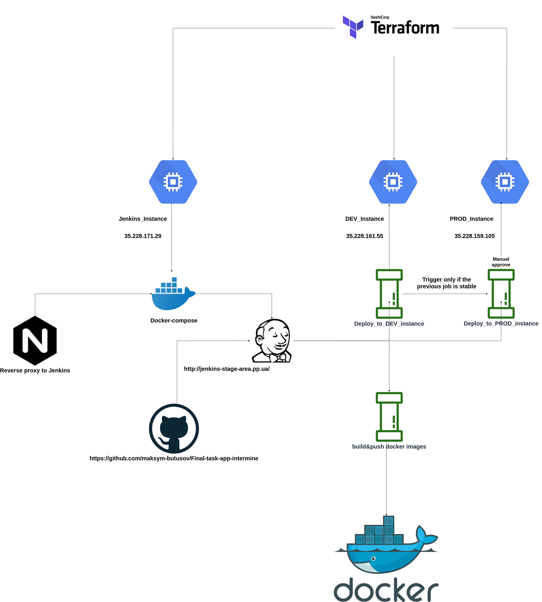

### Jekins pipelines for repo: https://github.com/maksym-butusov/docker-intermine-gradle

## Schema of the project:

### Tasks
1. Repository - https://github.com/intermine/intermine
2. Create 2 environments - dev and prod using terraform on any virtual platform (public cloud or local);
3. Configure environment using ansible playbook; Install application dependencies and set application configuration;
4. Create/configure Jenkins, using Jenkins docker image;
4. Create/configure Jenkins, using Jenkins docker image;
5. Using Jenkins create pipeline to build/test/deploy warehouse application;
    - the pipeline should be triggered automatically after commit to repo;
    - the deployment to dev should occur automatically, manual to prod;
    - you need to implement a solution to track application versions;
